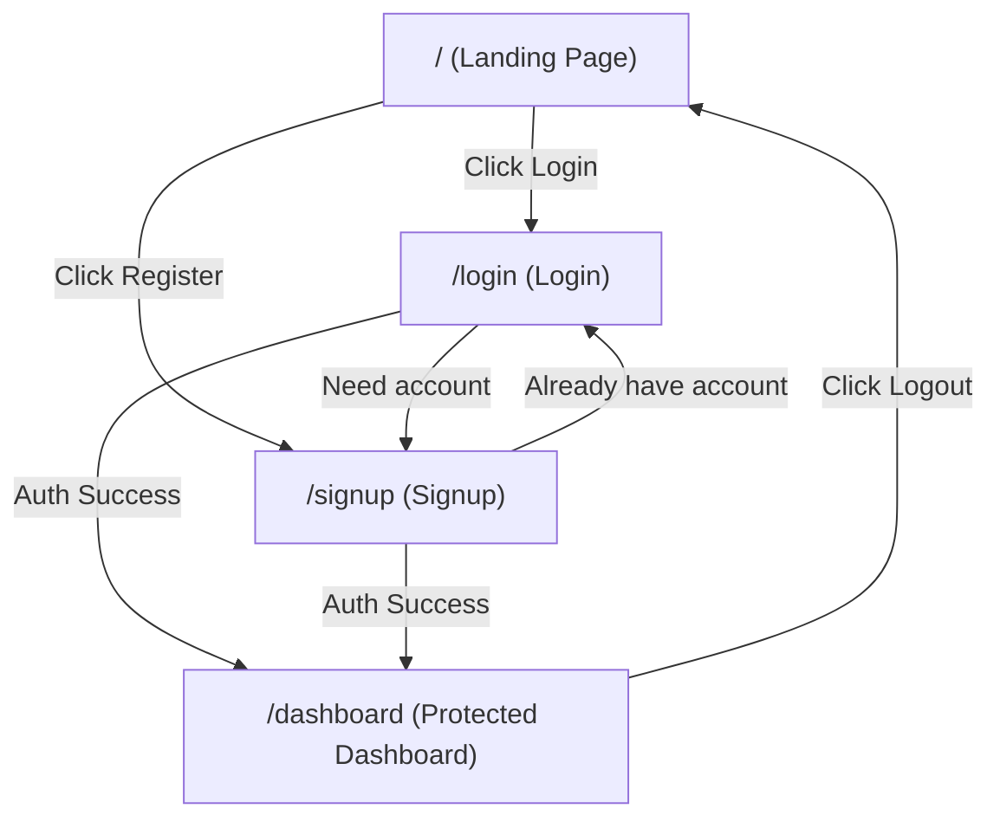
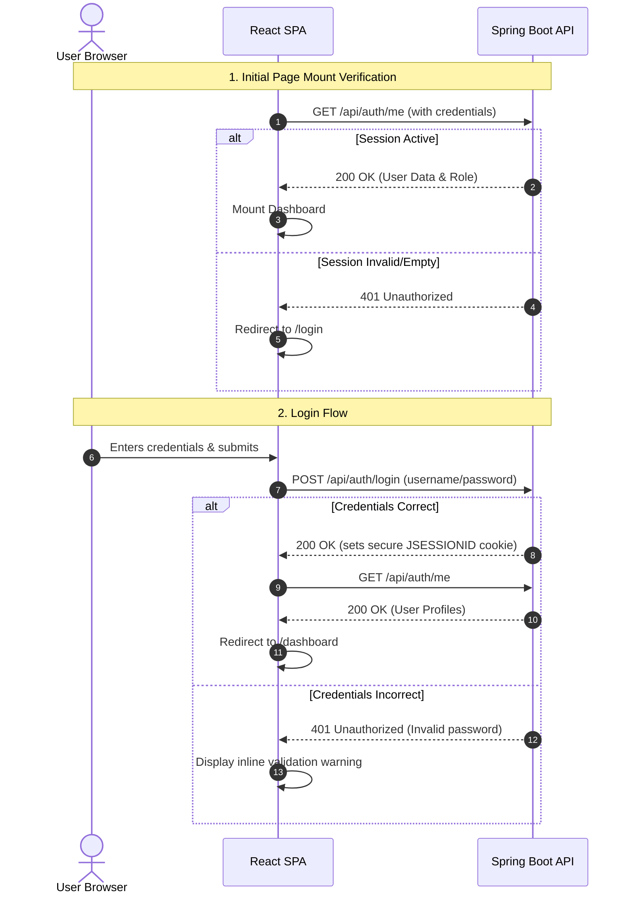
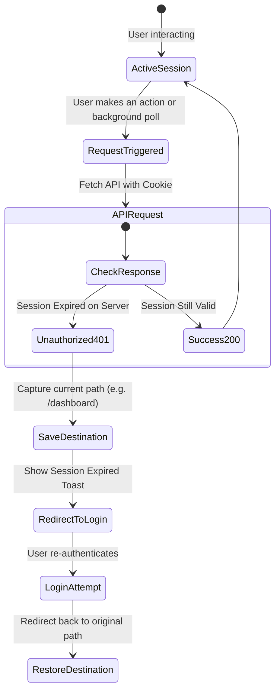

# Citizen Grievance Portal - User Experience (UX) Planning (Sprint 1)

This document contains the user journeys, routing logic, authentication lifecycles, and low-fidelity structural wireframes for the four pages of Sprint 1. These plans validate the user experience flow before coding starts.

---

## 1. User Journeys

### Journey A: Citizen Lodging and Tracking a Grievance
* **Persona**: Anjali, a resident experiencing a street lighting issue.
* **Steps**:
  1. **Discovery**: Arrives at Landing Page, reads core features (transparent tracking, fast turnaround).
  2. **Auth Entry**: Clicks "Get Started" and is redirected to **Signup Page** (or Login if she already has an account).
  3. **Registration**: Submits signup form with basic details. On success, is immediately redirected to the **Citizen Dashboard**.
  4. **Action**: Clicks "File a Grievance" on the dashboard.
  5. **Submission**: Fills out the form (Title, Category, Description). Fails validation on description length (notified instantly). Fixes it, submits.
  6. **Confirmation**: Receives a success prompt displaying reference ID `GRV-2026-08`.
  7. **Tracking**: Returns to dashboard, sees the new grievance listed as "Pending Review".

### Journey B: Government Officer Reviewing Grievances
* **Persona**: Mr. Ramesh, Municipal Officer.
* **Steps**:
  1. **Access**: Arrives at Portal, clicks "Sign In", enters municipal credentials.
  2. **Redirection**: Routed to the **Officer Dashboard** (customized density view).
  3. **Assessment**: Inspects list of active complaints. Uses filters to narrow down to his department (e.g. "Public Works").
  4. **Processing**: Clicks status dropdown on `GRV-2026-08` to change it to "In Progress". Fills in an internal note.
  5. **Completion**: Updates status to "Resolved" with a solution note. Sees list refresh automatically.

---

## 2. Navigation Flows



---

## 3. Authentication & Session Flow

The Spring Boot backend uses cookie-based sessions via the `JSESSIONID` cookie.



---

## 4. Session Expiration Flow

Spring Boot session expiration (timeout) is handled gracefully on the client:



---

## 5. Redirect Rules

1. **Rule 1 (Protected Path)**: If an unauthenticated user attempts to visit `/dashboard`, intercept route mounting, save target destination, and redirect to `/login` with an informational query parameter `?redirect=/dashboard`.
2. **Rule 2 (Guest Check)**: If an authenticated user visits `/login` or `/signup`, check the auth context. If active, intercept and auto-redirect back to `/dashboard`.
3. **Rule 3 (Root Fallback)**: If a user logs out, clear state storage, call logout endpoints, and redirect to the landing page `/`.

---

## 6. Error & Loading Flows

### Connection/Network Error Flow
```
[User Action] ➔ [Fetch Request Fails (Network offline)] ➔ [Display Global Alert Bar] 
                                                                   │
[User Clicks "Retry"] 🔀 [Verify Network Status] ➔ [Succeeds: Remove Alert]
```

### Form Loading & Submit States
- Form submission triggers a disabled inputs overlay and a loading button variant (`loading: true`).
- Dashboard lists render skeleton cards mirroring layout constraints during initialization to reduce layout shift (CLS).

---

## 7. Form Validation Flow

```
[User enters text in Input] ➔ [Wait for blur or change focus] ➔ [Validate regex/constraints]
                                                                        │
 ┌─────────────────────────────────── PASS ─────────────────────────────┴───── FAIL ──────┐
 ▼                                                                                         ▼
[Clear Error border]                                                              [Set input error=true]
[Enable submit button]                                                            [Display inline message]
                                                                                  [Disable submit button]
```

---

## 8. Mobile Navigation Hierarchy

### Hamburger Drawer Layout:
- When screen width `< md` (768px):
  - Top Navigation shows logo + Portal name + Menu Trigger button.
  - Clicking the menu trigger pulls down a full-width overlay containing all links.
  - Screen reader focus is locked to this overlay drawer until closed.

---

## 9. Low-Fidelity Wireframes (ASCII Mappings)

### Page A: Landing Page (Public)
```
+-----------------------------------------------------------------------+
|  CG Portal [Official]               Home  Submit  Track   [Register]  |
+-----------------------------------------------------------------------+
|                                                                       |
|                     RESOLVE PUBLIC CONCERNS                           |
|                      FAST, CLEAR & EMPATHIC                           |
|                                                                       |
|          Submit municipal grievances online and track progress        |
|          live. Built for citizens, officers, and administrators.      |
|                                                                       |
|                       [Submit Grievance]                              |
|                                                                       |
+-----------------------------------------------------------------------+
|  Why CG Portal?                                                       |
|                                                                       |
|  +--------------------+  +--------------------+  +--------------------+|
|  | [Icon]             |  | [Icon]             |  | [Icon]             | |
|  | Transparent Tracking|  | Rapid Turnaround   |  | Dedicated Support  | |
|  | Track progress live|  | Resolved quickly   |  | 24/7 assistance    | |
|  +--------------------+  +--------------------+  +--------------------+|
+-----------------------------------------------------------------------+
|  (C) 2026 Department of Public Grievances.          Compliance standard|
+-----------------------------------------------------------------------+
```

### Page B: Login Page (Public)
```
+-----------------------------------------------------------------------+
|  CG Portal [Official]                                                 |
+-----------------------------------------------------------------------+
|                                                                       |
|                         +-------------------+                         |
|                         |    Sign In        |                         |
|                         |    Welcome Back   |                         |
|                         |                   |                         |
|                         |    Email Address  |                         |
|                         |    [            ] |                         |
|                         |                   |                         |
|                         |    Password       |                         |
|                         |    [            ] |                         |
|                         |                   |                         |
|                         |    [ Sign In  ]   |                         |
|                         |                   |                         |
|                         |    Don't have an  |                         |
|                         |    account? Signup|                         |
|                         +-------------------+                         |
|                                                                       |
+-----------------------------------------------------------------------+
|  (C) 2026 Department of Public Grievances.                            |
+-----------------------------------------------------------------------+
```

### Page C: Signup Page (Public)
```
+-----------------------------------------------------------------------+
|  CG Portal [Official]                                                 |
+-----------------------------------------------------------------------+
|                                                                       |
|                         +-------------------+                         |
|                         |  Create Account   |                         |
|                         |  Register to File |                         |
|                         |                   |                         |
|                         |  Full Name        |                         |
|                         |  [            ]   |                         |
|                         |                   |                         |
|                         |  Email Address    |                         |
|                         |  [            ]   |                         |
|                         |                   |                         |
|                         |  Password         |                         |
|                         |  [            ]   |                         |
|                         |                   |                         |
|                         |  [ Register ]     |                         |
|                         |                   |                         |
|                         |  Already registered?|                       |
|                         |  Sign In          |                         |
|                         +-------------------+                         |
|                                                                       |
+-----------------------------------------------------------------------+
|  (C) 2026 Department of Public Grievances.                            |
+-----------------------------------------------------------------------+
```

### Page D: Dashboard (Protected View - Citizen Layout)
```
+-----------------------------------------------------------------------+
|  CG Portal [Official]                Notifications  [Rajesh Kumar v]  |
+-----------------------------------------------------------------------+
|                                                                       |
|  Welcome, Rajesh Kumar                                                |
|  Manage and track your submitted municipal grievances.                |
|                                                                       |
|  +-----------------------------------------------------------------+  |
|  | Grievance Overview                         [ + Submit Grievance] |  |
|  +-----------------------------------------------------------------+  |
|  | Search: [ Enter ID... ]                     Filter: [ All v ]   |  |
|  |                                                                 |  |
|  |  +-----------------------------------------------------------+  |  |
|  |  | GRV-2026-08: Streetlight Inoperative  [Pending Review]     |  |  |
|  |  | Submitted: Aug 2, 2026 | Category: Public Lighting        |  |  |
|  |  +-----------------------------------------------------------+  |  |
|  |  | GRV-2026-02: Water Leakage Main Road   [Resolved]         |  |  |
|  |  | Submitted: Jul 12, 2026 | Category: Public Water Works    |  |  |
|  |  +-----------------------------------------------------------+  |  |
|  +-----------------------------------------------------------------+  |
|                                                                       |
+-----------------------------------------------------------------------+
|  (C) 2026 Department of Public Grievances.          Compliance standard|
+-----------------------------------------------------------------------+
```
